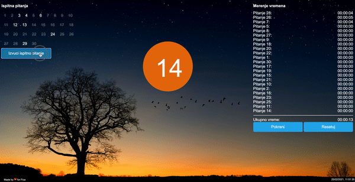

# Focusing timer for students

Very simple vanilla JS project based on famous Pomodoro technique 🍅 (a time management system that encourages people to work with the time they have).

As a new way to enhance productivity of students, the app measures the time student needs for studying each question for its exam.

## How it works?

- Enter the number of questions you have for your exam;
- The app will randomly select one by one question you should focus on (simulating the real exam conditions), until you finish with all your questions;
- For each question you may track time necessary for studying (commands start/stop/reset included);
- At the end you will know the exact time you spent focused on all your question.

## How it is built?

- HTML and CSS;
- Vanilla JS.

Made by ❤ for my brother Fica (>> veciti student <<)
